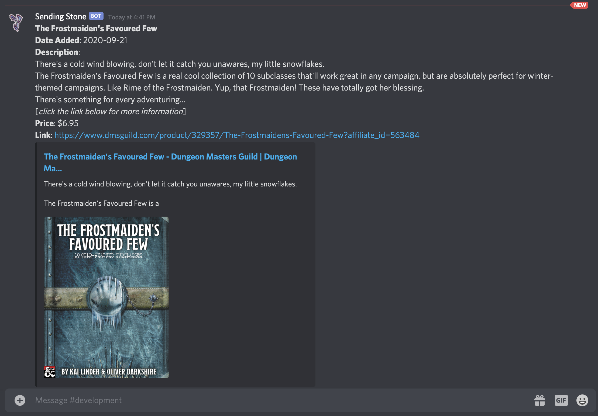

# DMs Guild Search - Discord Bot

## Running

* Copy `example-config.yaml` to `config.yaml`
  * Add your Discord token and the channel ID where you want the bot to post.
  * Edit the rest as desired.
* Run `discord_bot_dmsguild_search`
  * or `discord_bot_dmsguild_search.exe`
* It will post matching releases for the current day as they are posted.
  * When it is first run, it will post any earlier posts from the same day.

## Building

* `CGO_ENABLED=0 go build`
  * or for Windows:
    * `set CGO_ENABLED=0`
    * `go build`

### Build for Multi-Platforms

* `go get github.com/mitchellh/gox`
* `gox -osarch="windows/amd64 linux/amd64 darwin/amd64"`

## To Do

* FIXME notes in code...
